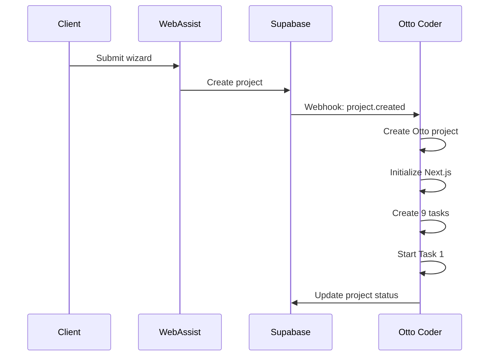
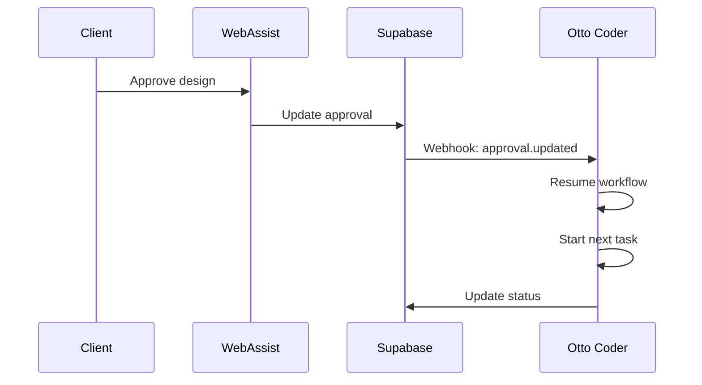
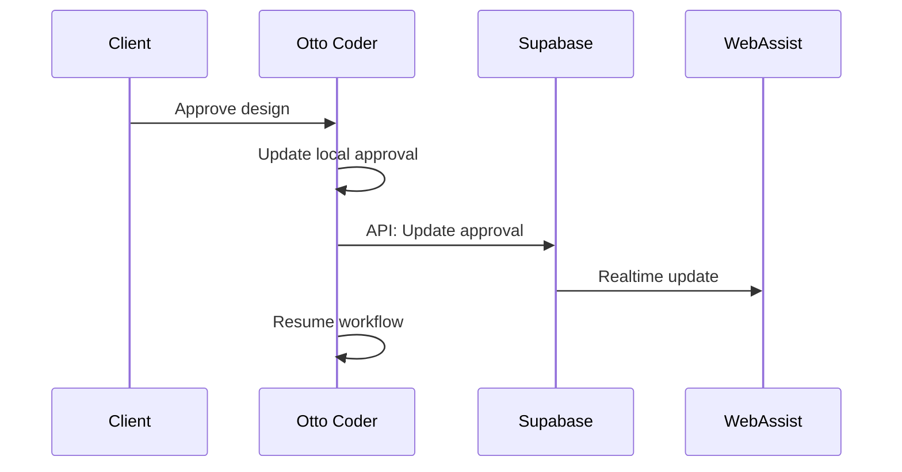

# WebAssist Frontend Integration Requirements

**Version**: 1.0
**Date**: 2025-10-27
**For**: WebAssist Frontend Team

---

## Overview

This document specifies the frontend changes required in the WebAssist project to integrate with Otto Coder's AI-powered development pipeline.

---

## API Endpoints to Call

### Base URL

```
https://otto-coder.your-domain.com
```

⚠️ **Note**: Replace `your-domain.com` with your actual Otto Coder deployment URL.

---

## 1. Get Otto Coder Project Status

**Endpoint**: `GET /api/web-assist/projects/{webassist_project_id}`

**Description**: Fetches the current status of AI agents working on the project.

**Parameters**:
- `webassist_project_id` (UUID): The WebAssist project ID from your `projects` table

**Response**:
```typescript
{
  "success": true,
  "data": {
    "otto_project_id": "uuid",
    "webassist_project_id": "uuid",
    "current_stage": "ai_research" | "design_mockup" | "development" | etc.,
    "sync_status": "active" | "paused" | "error" | "completed",
    "tasks": [
      {
        "stage": "initial_review",
        "task_id": "uuid",
        "status": "Done" | "InProgress" | "Todo",
        "progress": 0-100,
        "started_at": "2025-10-27T10:00:00Z",
        "completed_at": "2025-10-27T12:00:00Z" | null
      },
      // ... 9 tasks total (one per stage)
    ]
  }
}
```

**Usage**: Poll this endpoint every 10-30 seconds while AI is working to show real-time progress.

---

## 2. Get Stage Deliverables

**Endpoint**: `GET /api/web-assist/projects/{project_id}/stages/{stage_name}/deliverables`

**Description**: Fetch files and assets created by AI for a specific stage (for client preview).

**Parameters**:
- `project_id` (UUID): WebAssist project ID
- `stage_name` (string): One of: `ai_research`, `design_mockup`, `content_collection`, `client_preview`, `deployment`

**Response**:
```typescript
{
  "success": true,
  "data": [
    {
      "id": "uuid",
      "name": "Homepage Design.pdf",
      "url": "https://otto-coder.../files/...",
      "type": "application/pdf",
      "size": 2048576,
      "created_at": "2025-10-27T14:30:00Z"
    },
    {
      "id": "uuid",
      "name": "Figma Mockup",
      "url": "https://figma.com/...",
      "type": "link",
      "size": null,
      "created_at": "2025-10-27T14:35:00Z"
    }
  ]
}
```

**Usage**: Display deliverables in approval modals for client review.

---

## 3. Get Project Approvals

**Endpoint**: `GET /api/web-assist/projects/{project_id}/approvals`

**Description**: Fetch all approval requests for a project.

**Response**:
```typescript
{
  "success": true,
  "data": [
    {
      "id": "uuid",
      "web_assist_project_id": "uuid",
      "stage_name": "design_mockup" | "content_collection" | "client_preview",
      "approval_id": "uuid", // Your Supabase approval ID
      "status": "pending" | "approved" | "rejected" | "changes_requested",
      "requested_at": "2025-10-27T14:00:00Z",
      "responded_at": "2025-10-27T15:00:00Z" | null,
      "client_feedback": "Please make the logo bigger" | null,
      "preview_url": "https://staging.example.com" | null,
      "deliverables": "[...]", // JSON string
      "created_at": "2025-10-27T14:00:00Z",
      "updated_at": "2025-10-27T15:00:00Z"
    }
  ]
}
```

---

## 4. Submit Approval (from Otto Coder UI - Optional)

**Endpoint**: `POST /api/web-assist/approvals/{approval_id}`

**Description**: Submit approval decision from Otto Coder UI (optional - clients can approve in either UI).

**Request Body**:
```typescript
{
  "status": "approved" | "rejected" | "changes_requested",
  "feedback": "Optional feedback text" | null
}
```

**Response**:
```typescript
{
  "success": true,
  "data": null
}
```

**Note**: When a client approves in Otto Coder, it will sync back to your Supabase via webhook. Similarly, when approved in WebAssist, your webhook will notify Otto Coder.

---

## UI Components to Add

### 1. Otto Coder Status Indicator

**Location**: Project dashboard (alongside existing stage progress)

**Display**:
```
┌─────────────────────────────────────┐
│ 🤖 AI Agent Status                  │
├─────────────────────────────────────┤
│ Current Stage: AI Research          │
│ Progress: 45%                       │
│ Status: ⚡ Working                   │
│                                     │
│ [View Otto Coder Dashboard →]      │
└─────────────────────────────────────┘
```

**Status Icons**:
- ⚡ Working - AI agents actively working
- ⏸️ Waiting for Approval - Client action needed
- ✅ Stage Complete - Stage finished
- ⚠️ Error - Something went wrong

**Link to Otto Coder**:
```
https://otto-coder.your-domain.com/projects/{otto_project_id}
```

---

### 2. Real-Time Progress Updates

**Implementation**:
```typescript
// Polling approach (simple)
const [projectStatus, setProjectStatus] = useState(null);

useEffect(() => {
  const interval = setInterval(async () => {
    const response = await fetch(
      `https://otto-coder.your-domain.com/api/web-assist/projects/${projectId}`
    );
    const data = await response.json();
    setProjectStatus(data.data);
  }, 10000); // Poll every 10 seconds

  return () => clearInterval(interval);
}, [projectId]);
```

**Display**:
- Update stage progress bars in real-time
- Show current task status
- Display time estimates

---

### 3. Deliverables Preview in Approval Modal

**Location**: When client needs to approve design/content/preview

**Fetch Deliverables**:
```typescript
const fetchDeliverables = async (projectId, stageName) => {
  const response = await fetch(
    `https://otto-coder.your-domain.com/api/web-assist/projects/${projectId}/stages/${stageName}/deliverables`
  );
  const data = await response.json();
  return data.data;
};
```

**Display**:
```
┌─────────────────────────────────────────┐
│ Design Mockup Approval Needed           │
├─────────────────────────────────────────┤
│ AI has completed the design mockups.    │
│ Please review and approve:              │
│                                         │
│ 📄 Homepage Design.pdf                  │
│ 📄 About Page Design.pdf                │
│ 🔗 Figma Interactive Mockup             │
│                                         │
│ [Preview] [Download All]                │
│                                         │
│ [✅ Approve] [📝 Request Changes] [❌]  │
└─────────────────────────────────────────┘
```

---

### 4. Stage-Specific Information

**For Each Stage, Display**:

#### Initial Review (Stage 1)
- ⏱️ Duration: 2 hours
- 👤 Responsibility: Human team
- ✅ Auto-advances to AI Research

#### AI Research (Stage 2)
- ⏱️ Duration: 2 hours
- 🤖 Responsibility: AI agents
- 📊 Deep market research, competitor analysis
- ✅ Auto-advances to Design

#### Design Mockup (Stage 3)
- ⏱️ Duration: 8 hours
- 🤖 Responsibility: AI agents
- ⏸️ **Requires Client Approval**
- 📦 Deliverables: Mockups, design system

#### Content Collection (Stage 4)
- ⏱️ Duration: 6 hours
- 🤖 Responsibility: AI agents
- ⏸️ **Requires Client Approval**
- 📦 Deliverables: All website copy, SEO

#### Development (Stage 5)
- ⏱️ Duration: 16 hours
- 🤖 Responsibility: AI agents
- 💻 Building the full Next.js website
- ✅ Auto-advances to QA

#### Quality Assurance (Stage 6)
- ⏱️ Duration: 4 hours
- 👤 Responsibility: Human QA team
- 🧪 Testing on all browsers and devices
- ✅ Auto-advances to Client Preview

#### Client Preview (Stage 7)
- ⏱️ Duration: 6 hours
- 👤 Responsibility: Human team
- ⏸️ **Requires Client Approval**
- 🌐 Staging URL provided
- ✅ Advances to Deployment when approved

#### Deployment (Stage 8)
- ⏱️ Duration: 4 hours
- 🤖 Responsibility: AI agents
- 🚀 Deploying to production
- ✅ Auto-advances to Delivered

#### Delivered (Stage 9)
- 🎉 **Project Complete!**
- Website is live
- 30-day support begins

---

## Data Flow

### 1. New Project Created in WebAssist



### 2. Client Approves Design (WebAssist UI)



### 3. Client Approves in Otto Coder UI (Optional)



---

## Webhook Configuration

Otto Coder needs to receive webhooks from your Supabase when:

1. **Project created**: `project.created`
2. **Approval updated**: `approval.updated`

### Webhook URL

```
POST https://otto-coder.your-domain.com/api/web-assist/webhook
```

### Webhook Headers

```
X-Supabase-Signature: <HMAC-SHA256 signature>
Content-Type: application/json
```

### Webhook Payloads

#### project.created
```json
{
  "event": "project.created",
  "project_id": "uuid",
  "project_number": "WA-2025-001",
  "company_name": "ACME Corp",
  "wizard_completion_id": "uuid",
  "is_rush_delivery": false
}
```

#### approval.updated
```json
{
  "event": "approval.updated",
  "approval_id": "uuid",
  "project_id": "uuid",
  "status": "approved",
  "client_feedback": "Looks great!" | null
}
```

---

## Example React Implementation

```typescript
// hooks/useOttoCoder.ts
import { useState, useEffect } from 'react';

interface OttoCoderStatus {
  ottoProjectId: string;
  currentStage: string;
  syncStatus: string;
  tasks: Task[];
}

export const useOttoCoderStatus = (projectId: string) => {
  const [status, setStatus] = useState<OttoCoderStatus | null>(null);
  const [loading, setLoading] = useState(true);
  const [error, setError] = useState<string | null>(null);

  useEffect(() => {
    const fetchStatus = async () => {
      try {
        const response = await fetch(
          `https://otto-coder.your-domain.com/api/web-assist/projects/${projectId}`
        );
        if (!response.ok) throw new Error('Failed to fetch');
        const data = await response.json();
        setStatus(data.data);
        setError(null);
      } catch (err) {
        setError(err.message);
      } finally {
        setLoading(false);
      }
    };

    // Initial fetch
    fetchStatus();

    // Poll every 10 seconds
    const interval = setInterval(fetchStatus, 10000);

    return () => clearInterval(interval);
  }, [projectId]);

  return { status, loading, error };
};

// Usage in component
const ProjectDashboard = ({ projectId }) => {
  const { status, loading, error } = useOttoCoderStatus(projectId);

  if (loading) return <div>Loading AI status...</div>;
  if (error) return <div>Error: {error}</div>;

  return (
    <div className="otto-coder-status">
      <h3>🤖 AI Agent Status</h3>
      <p>Current Stage: {status.currentStage}</p>
      <p>Status: {status.syncStatus}</p>

      <div className="tasks">
        {status.tasks.map(task => (
          <div key={task.taskId} className="task">
            <span>{task.stage}</span>
            <span>{task.status}</span>
            {task.progress && <progress value={task.progress} max={100} />}
          </div>
        ))}
      </div>

      <a
        href={`https://otto-coder.your-domain.com/projects/${status.ottoProjectId}`}
        target="_blank"
      >
        View Otto Coder Dashboard →
      </a>
    </div>
  );
};
```

---

## Error Handling

### API Errors

All API endpoints return this format:

**Success**:
```json
{
  "success": true,
  "data": { ... }
}
```

**Error**:
```json
{
  "success": false,
  "error": "Error message here"
}
```

### Handle Network Errors

```typescript
const fetchWithRetry = async (url, retries = 3) => {
  for (let i = 0; i < retries; i++) {
    try {
      const response = await fetch(url);
      if (response.ok) return await response.json();
      if (response.status === 404) break; // Don't retry 404
    } catch (err) {
      if (i === retries - 1) throw err;
      await new Promise(resolve => setTimeout(resolve, 1000 * (i + 1)));
    }
  }
  throw new Error('Failed after retries');
};
```

---

## Testing

### Test Webhook Locally

```bash
curl -X POST https://otto-coder.your-domain.com/api/web-assist/webhook \
  -H "Content-Type: application/json" \
  -H "X-Supabase-Signature: test-signature" \
  -d '{
    "event": "project.created",
    "project_id": "test-uuid",
    "company_name": "Test Company",
    "wizard_completion_id": "test-uuid",
    "is_rush_delivery": false
  }'
```

### Test Status Endpoint

```bash
curl https://otto-coder.your-domain.com/api/web-assist/projects/{project_id}
```

---

## Security

### Authentication

Otto Coder API endpoints currently don't require authentication for webhooks (signature verified instead). For direct API calls from your frontend, consider:

1. **Option A**: Call from your backend (recommended)
   - Your Next.js API routes call Otto Coder
   - No CORS issues
   - Can add authentication

2. **Option B**: CORS allowlist
   - Configure Otto Coder to allow your domain
   - Direct frontend calls

### Webhook Signature Verification

Otto Coder verifies webhook signatures using HMAC-SHA256. Make sure:
- Use a strong secret key
- Never expose the secret in frontend code
- Rotate the secret periodically

---

## Support & Questions

For technical support:
- **Otto Coder Issues**: Contact Otto Coder team
- **Integration Issues**: Check this document first
- **Webhook Issues**: Verify Supabase triggers and Otto Coder logs

---

## Changelog

**v1.0** (2025-10-27)
- Initial release
- All 9 stages defined
- Webhook integration specified
- API endpoints documented

---

**End of Frontend Requirements Document**
